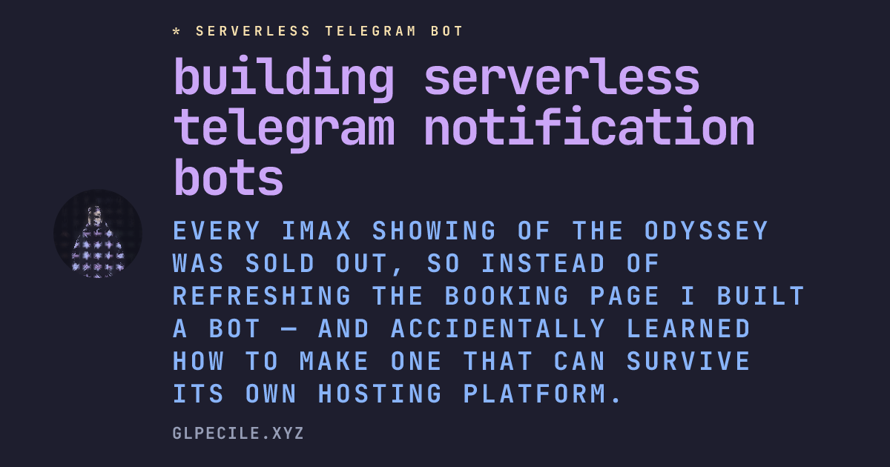
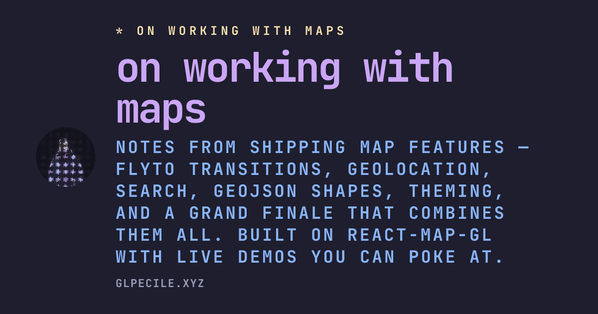
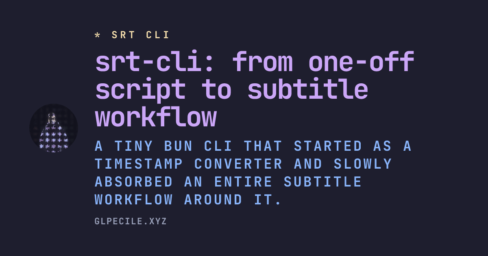
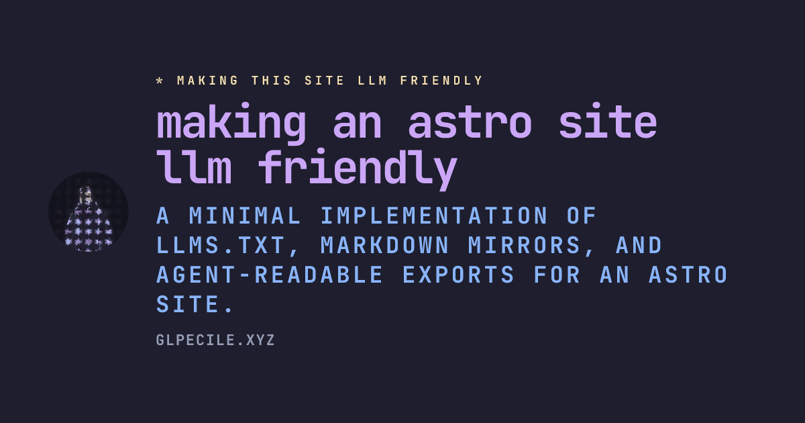

<!-- Generated daily at 04:17 UTC from https://glpecile.xyz/llms.txt by today.ts. Edit the website content, not this file. -->

# Gian Luca Pecile

**Senior Frontend Engineer @ [Humand](https://humand.co/)** Buenos Aires · Hybrid

Frontend engineer focused on design systems and high-craft product UI.

**[Website](https://glpecile.xyz/)** · [Work](https://glpecile.xyz/work) · [Writing](https://glpecile.xyz/blog)

## Writing

<table>
<tr>
<td width="25%" valign="top">

<strong><a href="https://glpecile.xyz/blog/serverless-telegram-bot">building serverless telegram notification bots</a></strong> <samp>18 Jul 2026</samp>

</td>
<td width="25%" valign="top">

<strong><a href="https://glpecile.xyz/blog/on-working-with-maps">on working with maps</a></strong> <samp>13 Jul 2026</samp>

</td>
<td width="25%" valign="top">

<strong><a href="https://glpecile.xyz/blog/srt-cli">srt-cli: from one-off script to subtitle workflow</a></strong> <samp>18 May 2026</samp>

</td>
<td width="25%" valign="top">

<strong><a href="https://glpecile.xyz/blog/making-this-site-llm-friendly">making an astro site llm friendly</a></strong> <samp>10 May 2026</samp>

</td>
</tr>
</table>

## GitHub

<a href="https://github.com/glpecile?tab=overview">
<picture>
  <source media="(prefers-reduced-motion: reduce) and (prefers-color-scheme: dark)" srcset="./assets/github-dark-static.svg">
  <source media="(prefers-reduced-motion: reduce)" srcset="./assets/github-light-static.svg">
  <source media="(prefers-color-scheme: dark)" srcset="./assets/github-dark.svg">
  
</picture>
</a>

## Recently watched

<table>
<tr>
<td width="25%" align="center" valign="top">

<strong><a href="https://letterboxd.com/glp/film/blood-and-black-lace/">Blood and Black Lace</a></strong> <samp>1964 · 28 Oct 2026</samp>

</td>
<td width="25%" align="center" valign="top">

<strong><a href="https://letterboxd.com/glp/film/fatherland-2026/">Fatherland</a></strong> <samp>2026 · 24 Oct 2026</samp>

</td>
<td width="25%" align="center" valign="top">

<strong><a href="https://letterboxd.com/glp/film/some-kind-of-heaven/">Some Kind of Heaven</a></strong> <samp>2020 · 20 Oct 2026</samp>

</td>
<td width="25%" align="center" valign="top">

<strong><a href="https://letterboxd.com/glp/film/love-of-your-life/">Love of Your Life</a></strong> <samp>2026 · 19 Oct 2026</samp>

</td>
</tr>
</table>

[X](https://x.com/glpwzrd) · [Bluesky](https://bsky.app/profile/glpecile.xyz) · [Letterboxd](https://letterboxd.com/Glp/)
